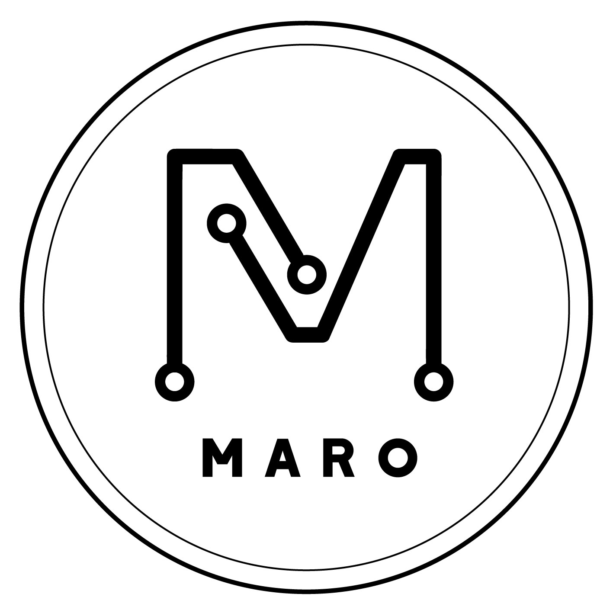

# maro-logo  

경희대학교 전자전파공학과 학술동아리 마로의 동아리 로고 AI(Adobe Illustrator File) 파일입니다.  

***

### maro-circle  

##### *Example*  

 

##### *Mockup*  
  

***

### maro-letter    

##### *Example*  

 

##### *Mockup*  
  

***

### maro-m  

##### *Example*  

 

##### *Mockup*  

***

### License  

[MIT License](https://github.com/KHU-MARO/maro-logo/blob/master/LICENSE)  

이 AI 파일의 저작권은 경희대학교 마로와, 김희연(Heeyeon Kim, 15학번)에게 있습니다.  
자유롭게 수정 및 사용은 가능하나 라이센스를 꼭 명시해 주시기 바랍니다.  